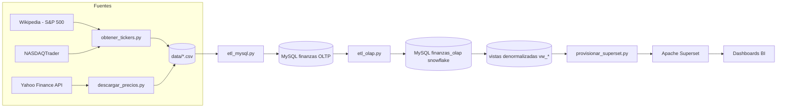
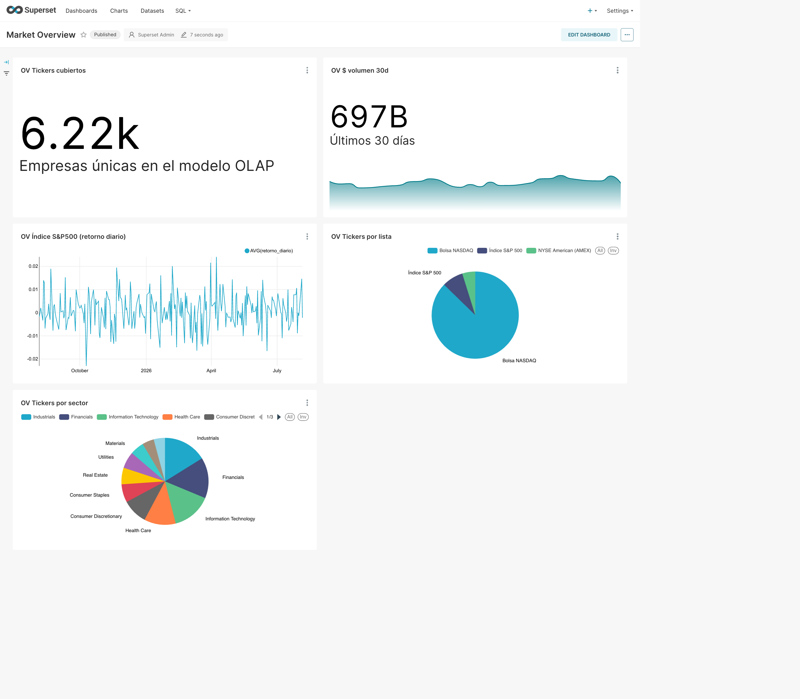
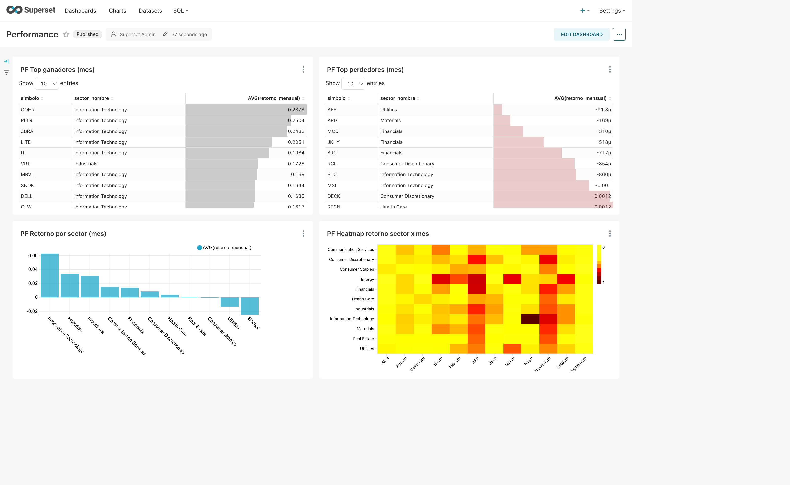
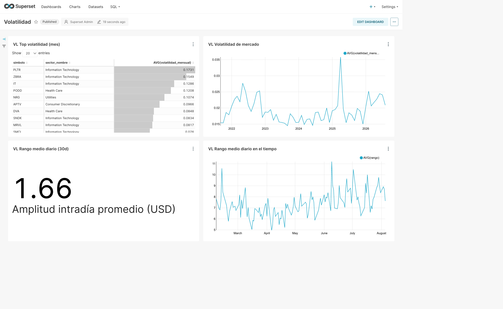
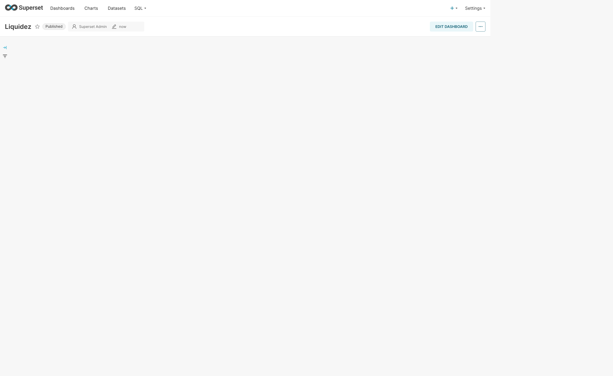
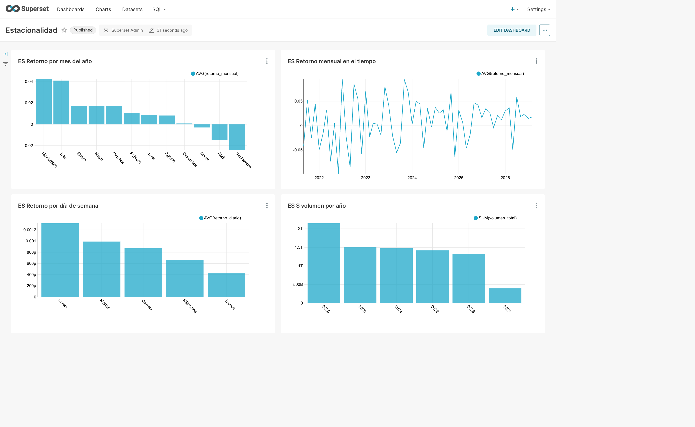

# Finanzas OLTP/OLAP — Pipeline de mercado accionario US

> **bookish-potato** · Rama `l02-oltp-olap`

Pipeline de datos completo para analítica de mercado accionario estadounidense:
descarga de tickers e históricos desde **Yahoo Finance**, modelado **OLTP** y **OLAP (snowflake)** en
**MySQL (Docker)**, y **5 dashboards** construidos programáticamente en **Apache Superset**.

Cubre ~**6.200 tickers** (S&P 500, NASDAQ, AMEX) con **~5,2 millones** de filas de precios diarios
(5 años: 2021-08 → 2026-08) y analítica precalculada (retornos, volatilidad, $volumen).

---

## Tabla de contenidos

1. [Arquitectura](#arquitectura)
2. [Stack tecnológico](#stack-tecnológico)
3. [Estructura del repositorio](#estructura-del-repositorio)
4. [Requisitos previos](#requisitos-previos)
5. [Puesta en marcha rápida](#puesta-en-marcha-rápida)
6. [Pipeline de datos](#pipeline-de-datos)
7. [Modelo OLTP](#modelo-oltp)
8. [Modelo OLAP (snowflake)](#modelo-olap-snowflake)
9. [Dashboards](#dashboards)
10. [Referencia de scripts](#referencia-de-scripts)
11. [Seguridad](#seguridad)
12. [Reproducibilidad e idempotencia](#reproducibilidad-e-idempotencia)
13. [Solución de problemas](#solución-de-problemas)
14. [Consideraciones sobre los datos](#consideraciones-sobre-los-datos)

---

## Arquitectura



- **Fuentes externas** → CSVs locales (`data/`, ignorado por git).
- **ETL OLTP** (`etl_mysql.py`): carga listas, tickers, membresías y precios mediante
  `LOAD DATA LOCAL INFILE` en paralelo (sin cuellos de botella).
- **ETL OLAP** (`etl_olap.py`): construye el cubo snowflake con retornos/volatilidad precalculados
  mediante `INSERT...SELECT` con window functions, cross-database dentro del servidor.
- **BI**: Apache Superset con datasets sobre vistas denormalizadas, charts y dashboards creados por API.

---

## Stack tecnológico

| Capa | Tecnología |
|---|---|
| Orquestación | Docker + Docker Compose |
| OLTP | MySQL 8.4 (InnoDB, `utf8mb4`) |
| OLAP | MySQL 8.4 — esquema snowflake (dimensiones normalizadas + hechos) |
| BI | Apache Superset 4.1.4 (`mysqlclient`/`pymysql` pinnados) |
| Lenguaje | Python 3.13 con [uv](https://docs.astral.sh/uv/) |
| Descarga | `httpx` asíncrono con semáforo, reintentos y backoff |
| Procesamiento | `pandas`, `pymysql` |
| Diagramas | Mermaid + `mmdc` (mermaid-cli) |

---

## Estructura del repositorio

```
.
├── compose.yml                     # Servicios MySQL + Superset (+ init)
├── .env.example                    # Plantilla de variables de entorno (copiar a .env)
├── pyproject.toml / uv.lock        # Dependencias Python reproducibles
├── docker/
│   ├── mysql/
│   │   ├── init/
│   │   │   ├── 01_schema.sql       # Esquema OLTP (lista, ticker, ticker_lista, precio)
│   │   │   └── 02_usuarios.sh      # Usuarios de mínimo privilegio (etl / dashboards)
│   │   └── olap/
│   │       └── 01_schema_olap.sql  # Esquema OLAP snowflake + vistas vw_*
│   └── superset/
│       ├── Dockerfile              # apache/superset + drivers MySQL pinnados
│       └── init/
│           ├── init.sh             # db upgrade, admin, permisos
│           ├── init_database.py    # Registra conexiones MySQL (usuario dashboards)
│           └── asociar_charts.py   # Asocia charts↔dashboards (relación slices)
├── scripts/
│   ├── obtener_tickers.py          # Listas de tickers (SP500/NASDAQ/AMEX) → data/
│   ├── descargar_precios.py        # Históricos diarios 5y desde Yahoo Finance (async)
│   ├── etl_mysql.py                # ETL → OLTP (LOAD DATA paralelo)
│   ├── etl_olap.py                 # ETL → OLAP snowflake (retornos, volatilidad)
│   ├── provisionar_superset.py     # Datasets + 21 charts + 5 dashboards (REST API)
│   └── _config.py                  # Carga .env y config de conexión (usuario etl)
├── docs/                           # Diagramas mermaid/PNG, capturas de dashboards, auditoría
└── data/                           # Generada: CSVs de tickers y precios (NO versionada)
```

---

## Requisitos previos

- **Docker** + **Docker Compose** (v2)
- **uv** ([instalación](https://docs.astral.sh/uv/))
- **mmdc / mermaid-cli** (opcional, solo para regenerar diagramas)

---

## Puesta en marcha rápida

```bash
# 1. Variables de entorno (claves, contraseñas)
cp .env.example .env            # editar con valores reales

# 2. Levantar MySQL + Superset (el init crea esquema, usuarios y conexiones)
docker compose up -d --build

# 3. Dependencias Python
uv sync

# 4. (Opcional) Descargar datos de mercado: tickers + precios 5 años
uv run python scripts/obtener_tickers.py
uv run python scripts/descargar_precios.py

# 5. Cargar el OLTP (5,2 M filas, ~45 s)
uv run python scripts/etl_mysql.py

# 6. Construir el OLAP snowflake (~3 min)
uv run python scripts/etl_olap.py

# 7. Crear datasets, charts y dashboards en Superset (idempotente)
uv run python scripts/provisionar_superset.py
```

**Acceso:**

| Servicio | URL | Credenciales (dev) |
|---|---|---|
| Apache Superset | http://localhost:8088 | `SUPERSET_ADMIN_USER` / `SUPERSET_ADMIN_PASSWORD` (`.env`) |
| MySQL | `127.0.0.1:3306` | usuarios `etl` / `dashboards` (ver [Seguridad](#seguridad)) |

> Los puertos están enlazados solo a `127.0.0.1` (no expuestos a la red).

---

## Pipeline de datos

### 1. Tickers (`obtener_tickers.py`)
- **S&P 500** (502): tabla de Wikipedia (símbolo, nombre, sector y subsector GICS).
- **NASDAQ** (5.568): `nasdaqlisted.txt` de NASDAQTrader.
- **AMEX / NYSE American** (308): `otherlisted.txt` filtrado por exchange `A`.
- Normaliza símbolos a formato Yahoo (`BRK.B` → `BRK-B`) y conserva `NA` real
  (pandas trata `NA` como nulo; se lee con `keep_default_na=False`).
- Salida: `data/sp500.csv`, `data/nasdaq.csv`, `data/amex.csv`, `data/tickers_all.csv`.

### 2. Precios (`descargar_precios.py`)
- API pública `query1.finance.yahoo.com/v8/finance/chart/{symbol}`, rango **5 años**, granularidad **diaria**.
- **Asíncrono** (`httpx` + semáforo de 25 conexiones), reintentos con backoff exponencial ante `429/5xx`.
- **Resumible**: omite tickers ya descargados (`data/prices/{SIMBOLO}.csv`).
- ~6.200 archivos, ~5,24 M de filas totales.

### 3. ETL OLTP (`etl_mysql.py`)
- Recrea el esquema de forma idempotente y carga en este orden: `lista` → `ticker` → `ticker_lista` → `precio`.
- **Sin cuellos de botella**: `LOAD DATA LOCAL INFILE` con 8 workers paralelos, `FOREIGN_KEY_CHECKS=0`
  durante la carga, índices/FK fuera del bulk y recreados al final.
- Verificación: conteos contra el origen y chequeo de huérfanos.

### 4. ETL OLAP (`etl_olap.py`)
- Construye `finanzas_olap` (snowflake) leyendo del OLTP **dentro del servidor** (0 filas cruzan la red).
- `fact_precio_diario`: retornos (`LAG OVER`), retorno logarítmico, rango y $volumen precalculados.
- `fact_precio_mensual`: OHLC de mes, retorno mensual y **volatilidad** (`STDDEV_SAMP`).
- `hecho_membresia`: composición de listas (factless).

---

## Modelo OLTP

Base `finanzas` — 4 tablas relacionales (diagramas: `docs/modelo_er.*`, `docs/modelo_relacional.*`).

| Tabla | Grano | Claves | Notas |
|---|---|---|---|
| `lista` | 1 lista | `id` PK, `codigo` UK | SP500 / NASDAQ / AMEX |
| `ticker` | 1 empresa | `id` PK, `simbolo` UK | nombre, sector, subsector (GICS, solo S&P500) |
| `ticker_lista` | membresía | PK `(ticker_id, lista_id)` | N:M con FKs |
| `precio` | ticker × día | PK `(ticker_id, fecha)` | OHLCV + `adj_close`; `idx_fecha` |

---

## Modelo OLAP (snowflake)

Base `finanzas_olap` — dimensiones normalizadas en niveles + hechos (diagrama: `docs/modelo_olap.*`).

**Dimensiones (normalizadas → snowflake):**

```
dim_anio ◄── dim_mes ◄── dim_fecha
dim_sector ◄── dim_subsector ◄── dim_empresa
dim_lista
```

**Hechos:**

| Hecho | Grano | Medidas precalculadas | Filas |
|---|---|---|---|
| `fact_precio_diario` | empresa × día | open/high/low/close/adj_close, volumen, retorno_diario, retorno_log, retorno_ajustado, rango, volumen_dolares | 5.242.479 |
| `fact_precio_mensual` | empresa × mes | open_primero, close_ultimo, high_max, low_min, volumen_total, retorno_mensual, volatilidad_mensual, n_dias | 258.049 |
| `hecho_membresia` | sin medidas | empresa_id, lista_id | 6.378 |

**Vistas denormalizadas (para BI):** `vw_empresa`, `vw_membresia`, `vw_diario`, `vw_mensual`.
Incluyen flags `es_sp500` / `es_nasdaq` / `es_amex` (membership sin multiplicar filas)
y `fecha_mes` (fecha real para series temporales sobre el fact mensual).

---

## Dashboards

Cinco dashboards (21 charts) creados programáticamente vía REST API
(`scripts/provisionar_superset.py`), con capturas en `docs/dash_*.png`.

| Dashboard | Slug | Charts | Qué responde |
|---|---|---|---|
| **Market Overview** | `finanzas-overview` | 5 | tickers cubiertos, $volumen 30d, índice S&P500 simulado, distribución por lista y sector |
| **Performance** | `finanzas-performance` | 4 | top ganadores/perdedores del mes, retorno por sector, heatmap sector × mes |
| **Volatilidad** | `finanzas-volatilidad` | 4 | ranking de volatilidad, volatilidad de mercado en el tiempo, rango intradía |
| **Liquidez** | `finanzas-liquidez` | 4 | top $volumen y volumen (30d), $volumen por sector y diario |
| **Estacionalidad** | `finanzas-estacionalidad` | 4 | retorno por mes del año, serie mensual, efecto día de semana, $volumen por año |

Cada chart se **valida** (query ejecutada) antes de persistirse; el provisionador asocia después los
charts a sus dashboards (`slices`) vía el modelo interno de Superset.

### Capturas

#### Market Overview


#### Performance


#### Volatilidad


#### Liquidez


#### Estacionalidad


---

## Referencia de scripts

| Script | Uso | Idempotente |
|---|---|---|
| `scripts/obtener_tickers.py` | Regenerar listas de tickers | Sí |
| `scripts/descargar_precios.py` | Descargar precios 5y (async, resumible) | Sí |
| `scripts/etl_mysql.py` | Reconstruir el OLTP | Sí (drop + recreate) |
| `scripts/etl_olap.py` | Reconstruir el OLAP snowflake | Sí (drop + recreate) |
| `scripts/provisionar_superset.py` | Datasets + charts + dashboards en Superset | Sí (borra y recrea los `OV/PF/VL/LQ/ES` y dashboards `finanzas-*`) |

---

## Seguridad

Auditoría completa en `docs/SECURITY_AUDIT.md`. Resumen de lo aplicado:

- **Secretos fuera del código**: credenciales en `.env` (ignorado por git). Plantilla en `.env.example`.
- **Mínimo privilegio** en MySQL (creados por `docker/mysql/init/02_usuarios.sh`):
  - `etl` → gestión (DDL + carga) solo de `finanzas` y `finanzas_olap`.
  - `dashboards` → **solo SELECT** (usado por Superset; verificado: `INSERT` denegado).
- **Puertos enlazados a `127.0.0.1`** (MySQL `3306` y Superset `8088`).
- `SUPERSET_SECRET_KEY` desde entorno; dependencias del image **pinnadas**.
- Límites de memoria/processos en los contenedores.
- `.env` y `data/` excluidos del control de versiones.

> Para entornos compartidos/producción: cambiar credenciales en `.env`, evaluar TLS y escaneo de
> imágenes (Trivy). Ver detalle y matriz de severidad en `docs/SECURITY_AUDIT.md`.

---

## Reproducibilidad e idempotencia

- `uv.lock` + `pyproject.toml` → árbol Python reproducible; SCA limpio (`uvx pip-audit`: 0 CVEs).
- Todos los ETL y el provisionador son **idempotentes**: se pueden re-ejecutar sin efectos colaterales.
- Los `docker-entrypoint-initdb.d` se ejecutan solo en volumen nuevo; los usuarios de BD se
  (re)crean con `CREATE USER IF NOT EXISTS` / `ALTER USER`.

---

## Solución de problemas

| Síntoma | Causa / solución |
|---|---|
| `Unknown database 'finanzas_olap'` | Correr primero `etl_olap.py` (crea el esquema) o `docker/mysql/olap/01_schema_olap.sql`. |
| Superset muestra charts "sin definición" | Faltó la asociación `slices`: re-ejecutar `provisionar_superset.py` (la hace al final). |
| Queries OLAP lentas | El buffer pool de MySQL está en 1G (`compose.yml`); reutilizar `fact_precio_mensual` para agregados. |
| `pip-audit` no disponible en `uv` | Usar `uvx pip-audit --path .venv`. |
| Símbolo `NA` (Nano Labs) desaparece | pandas lee `NA` como nulo; los scripts usan `keep_default_na=False`. |

---

## Consideraciones sobre los datos

- Fuentes: **Yahoo Finance** (precios), **Wikipedia** y **NASDAQTrader** (listas). Datos de mercado
  solo con fines académicos/didácticos, **no son asesoría financiera**.
- Cobertura: **5 años de datos diarios** (2021-08-06 → 2026-08-05). Yahoo agrega a nivel mensual si se
  pide `range=max&interval=1d`, por eso el ETL usa rangos de 5 años.
- El sector GICS solo está disponible para los miembros del S&P 500 (~502); el resto queda
  clasificado como `Sin clasificar`.
- `data/` no se versiona (~530 MB); regenerable con `obtener_tickers.py` + `descargar_precios.py`.
