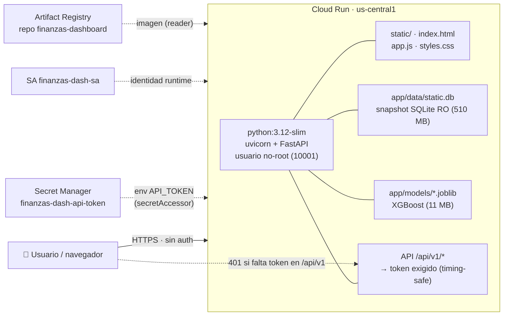

# INFRA ATLAS — Forecast Dashboard en Cloud Run

**Fecha:** 2026-08-12 · **Proyecto:** `<MI-PROYECTO-GCP>` · **Región:** `us-central1`
**Última revisión activa:** `<revision>` · **Imagen:** `…:<tag>`

---

## 1. Topología (Mermaid)



## 2. Inventario de recursos (estado real)

| Recurso | Nombre / ID | Detalle |
|---|---|---|
| **Cloud Run service** | `finanzas-dashboard` | gen2, us-central1 |
| **URL pública** | `https://<servicio>-<hash>-uc.a.run.app` | alias: `https://<servicio>-<numero-proyecto>.us-central1.run.app` |
| **Imagen activa** | `us-central1-docker.pkg.dev/<MI-PROYECTO-GCP>/finanzas-dashboard/finanzas-dashboard:<tag>` | digest `<sha256>` |
| **Imágenes históricas (AR)** | 1 tag por despliegue (`<timestamp>` + `latest`) | conservadas en el repo |
| **Service Account** | `finanzas-dash-sa@<MI-PROYECTO-GCP>.iam.gserviceaccount.com` | mínimo privilegio (ver §6) |
| **Secret** | `finanzas-dash-api-token` | token de API hex-48, rotable con `make token` |
| **Artifact Registry** | repo `finanzas-dashboard` | formato Docker, us-central1 |

## 3. Configuración del servicio (verificada)

| Parámetro | Valor |
|---|---|
| CPU | **1 vCPU** (1) |
| Memoria | **1 GiB** |
| Min / Max instancias | **0 / 1** (scale-to-zero; `autoscaling.knative.dev/maxScale: '1'`) |
| Concurrencia | **10** requests/instancia |
| Timeout | **120 s** |
| CPU allocation | solo durante handling (`--cpu-throttling`); `startup-cpu-boost: false` |
| Autenticación | **allow-unauthenticated** (allUsers → `roles/run.invoker`); rutas `/api/v1/*` protegidas por token |
| Puerto | 8080 (solo contenedor; Cloud Run expone HTTPS) |

### Variables de entorno

| Var | Valor | Uso |
|---|---|---|
| `DATA_MODE` | `sqlite` | leer snapshot estático (sin MySQL en runtime) |
| `STATIC_DIR` | `/app/static` | frontend estático |
| `MODELS_DIR` | `/app/models` | modelos `.joblib` |
| `STATIC_DB` | `/app/data/static.db` | snapshot SQLite (510 MB) |
| `API_TOKEN` | ← `finanzas-dash-api-token:latest` | valida `/api/v1/*` |

## 4. Endpoints y contratos

| Método | Ruta | Auth | Ejemplo |
|---|---|---|---|
| GET | `/` | pública | sirve UI; inyecta `window.__API_TOKEN__` |
| GET | `/api/v1/health` | token | `{"status":"ok","modelo":…}` |
| GET | `/api/v1/tickers?q=GENTERA&lista=&sector=` | token | autocomplete → `{tickers:[…]}` |
| GET | `/api/v1/ticker/{sim}/history?desde=&hasta=` | token | OHLCV 5 años |
| GET | `/api/v1/ticker/{sim}/forecast` | token | banda q10/q50/q90 + prob ↑/↓ |

Auth: `Authorization: Bearer <token>` o `?token=<token>` (token de 48 hex). 401 sin token.

## 5. Pipeline de despliegue (`deploy/Makefile`)

```
make -f deploy/Makefile deps      # repo AR + SA + roles granulares + Secret
make -f deploy/Makefile token     # genera/rota token → Secret Manager
make -f deploy/Makefile snapshot  # exporta static.db desde MySQL (solo lectura)
make -f deploy/Makefile build     # docker buildx → linux/amd64
make -f deploy/Makefile push      # 2 tags (timestamp + latest) a AR
make -f deploy/Makefile deploy    # = deps + token + build + push + deploy + (logs de inicio)
make -f deploy/Makefile validate-remote  # smoke test de endpoints (401/200 + UI)
make -f deploy/Makefile scan      # Trivy HIGH/CRITICAL
make -f deploy/Makefile cost      # estimación mensual
make -f deploy/Makefile qa        # IAM policy + secret bindings
make -f deploy/Makefile url       # imprime URL del servicio
make -f deploy/Makefile destroy   # borra servicio (+ SA/repo/secret con confirmación)
make -f deploy/Makefile atlas     # genera deploy/INFRA_ATLAS_LIVE.md (snapshot del estado live; este atlas curado es el de referencia)
```

## 6. Seguridad (resumen)

- **Identidad:** SA con **solo** `roles/artifactregistry.reader`, `roles/logging.logWriter`, `roles/monitoring.metricWriter` (proyecto) + `roles/secretmanager.secretAccessor` **sobre el secret** (binding a nivel recurso). Sin editor/owner.
- **Secretos:** token NO está en la imagen (env de Secret Manager en runtime); `.env`/`.api_token` excluidos del build y gitignored.
- **Contenedor:** usuario no-root (10001); snapshot y modelos montados **read-only**.
- **App:** SQL parametrizado, comparación de token timing-safe (`hmac.compare_digest`), `html.escape` del token, frontend sin `innerHTML`, headers `nosniff`/`X-Frame-Options: DENY`/`no-referrer`/`no-store`.
- **SCA:** Python 0 CVEs (`pip-audit` in-imagen). OS Debian 13: 19 HIGH / 4 CRITICAL **sin fix disponible** (trixie) → riesgo residual aceptado (proceso no-root, snapshot RO, sin egress, paquetes no alcanzables). Re-ejecutar `make scan` cuando Debian publique fixes.
- **Auditoría completa:** `deploy/security/SECURITY_AUDIT_CLOUDRUN.md` (veredicto: **clearance otorgado**).

## 7. Costo mensual estimado

| Escenario | Requests/mes | Costo |
|---|---|---|
| Uso académico (demo) | ~5k | **≈ $0.12** (free tier absorbe casi todo) |
| Uso moderado | ~100k | **≈ $1.32** |
| Pico sostenido | 1M | **≈ $12.0** |

Free tier Cloud Run (2M req, 360k GB-s CPU, 180k GB-s memoria) cubre el caso académico. Detalle en `deploy/COST_ESTIMATE.md`. Sin Cloud SQL, sin GCS, sin LB, sin Cloud Armor: **frugalidad verificada** (sin capas innecesarias).

## 8. Operaciones y troubleshooting

| Síntoma | Causa | Acción |
|---|---|---|
| 503 en arranque tras deploy | cold start de imagen ~1 GB | esperar; `--startup-cpu-boost=false` deliberado; timeout 120s | 
| `/api/v1` 401 | falta token en la llamada | `Authorization: Bearer <token>` |
| 503 "API token no configurado" | secret no accesible | `make deps token` y verificar binding `secretAccessor` |
| Front sin datos (401 en red) | se abrió `/index.html` directo (token vacío) | usar `/` (página servida) |
| Datos desactualizados | snapshot viejo | `make snapshot && make deploy` |
| CVE de sistema | Debian trixie sin fix aún | `make scan`; migrar a distroless cuando se valide |

## 9. Teardown

`make -f deploy/Makefile destroy` elimina el servicio Cloud Run (y, confirmando, SA, repo AR y Secret). Con `-e TEARDOWN_FULL=1` además desactiva las políticas de IAM creadas.
