# Diagrama Entidad-Relación (ER) — RAMA OLTP

Modelo relacional 4FN para datos horarios de calidad del aire (CDMX).

## Entidades

**CONTAMINANTE** — Catálogo de contaminantes + rangos físicos
- `codigo` (PK): CO, NO, NO2, NOX, O3, PM10, PM25, PMCO, SO2
- `nombre`: Nombre descriptivo
- `unidad`: ppm, ppb, µg/m³
- `valor_min`, `valor_max`: Rangos físicos válidos

**ESTACION** — Códigos de estación (surrogate key)
- `estacion_id` (PK): IDENTITY
- `codigo`: 3 letras (ACO, LPR, etc.)
- `fecha_creacion`: Auditoría

**ESTACION_PERIODO** — Dimensión lenta (SCD Type 2, historia temporal)
- `periodo_id` (PK): IDENTITY
- `estacion_id` (FK): Referencia a estación
- `nombre_estacion`, `alcaldia`: Metadata
- `latitud`, `longitud`: WGS84 coordinates
- `geom`: GEOGRAPHY generada para `ST_DWithin()`
- `fecha_inicio`, `fecha_fin`: Período activo (NULL = vigente)

**MEDICION** — Tabla de hechos (mediciones horarias)
- `medido_en` (PK): TIMESTAMP (fecha + hora)
- `estacion_id` (PK, FK): Referencia a estación
- `contaminante_codigo` (PK, FK): Referencia a contaminante
- `valor`: REAL, NULL permitido (datos faltantes)

## Relaciones

- **CONTAMINANTE** ←1:N→ **MEDICION** — Un contaminante tiene muchas mediciones
- **ESTACION** ←1:N→ **ESTACION_PERIODO** — Una estación tiene múltiples períodos (SCD Type 2)
- **ESTACION_PERIODO** ←1:N→ **MEDICION** — Un período tiene muchas mediciones

## Normalización (4FN)

✅ Todas las entidades en forma normal 4FN:
- Sin dependencias multivaluadas
- PK compuesta en MEDICION previene duplicados
- FK constraints garantizan integridad referencial
- Triggers validan invariantes (rango de valores, periodos no solapados)

## Volúmenes

| Tabla | Registros | Notas |
|-------|-----------|-------|
| CONTAMINANTE | 9 | Dimensión pequeña |
| ESTACION | 54 | Dimensión pequeña |
| ESTACION_PERIODO | ~57 | SCD Type 2 (51 períodos continuos + 3 con gaps) |
| MEDICION | 50.3M | Hechos (1986-2025, 40 años) |
