# Especificación Física — RAMA OLTP

Definición completa de tablas, tipos de datos, constraints e índices.

## Tablas

### `rama.contaminante`

| Columna | Tipo | Constraints |
|---------|------|------------|
| `codigo` | CHAR(5) | PK |
| `nombre` | VARCHAR(100) | NOT NULL |
| `unidad` | VARCHAR(20) | NOT NULL |
| `valor_min` | REAL | DEFAULT 0.0, CHECK ≥ 0 |
| `valor_max` | REAL | NOT NULL, CHECK > valor_min |

Catálogo de 9 contaminantes con rangos físicos válidos.

---

### `rama.estacion`

| Columna | Tipo | Constraints |
|---------|------|------------|
| `estacion_id` | SMALLINT | PK, GENERATED ALWAYS AS IDENTITY |
| `codigo` | CHAR(3) | UNIQUE, NOT NULL, CHECK `~ '^[A-Z]{3}$'` |
| `fecha_creacion` | DATE | DEFAULT CURRENT_DATE |

Surrogate key para 54 estaciones RAMA. Evita cambios en PK si códigos se actualizan.

**Índices:**
- `idx_estacion_codigo` (codigo)

---

### `rama.estacion_periodo`

| Columna | Tipo | Constraints |
|---------|------|------------|
| `periodo_id` | BIGINT | PK, GENERATED ALWAYS AS IDENTITY |
| `estacion_id` | SMALLINT | FK REFERENCES estacion, NOT NULL |
| `nombre_estacion` | VARCHAR(100) | NOT NULL |
| `alcaldia` | VARCHAR(50) | NOT NULL |
| `latitud` | NUMERIC(9,6) | NOT NULL, CHECK -90 ≤ x ≤ 90 |
| `longitud` | NUMERIC(9,6) | NOT NULL, CHECK -180 ≤ x ≤ 180 |
| `geom` | GEOGRAPHY | GENERATED AS ST_Point(lon, lat, 4326) |
| `fecha_inicio` | DATE | NOT NULL |
| `fecha_fin` | DATE | NULL = período vigente |
| `activo` | BOOLEAN | DEFAULT TRUE |

**SCD Type 2**: Historia temporal de estaciones. Múltiples registros por estación si fue desactivada/reactivada.

**Constraints:**
- `CHECK fecha_fin IS NULL OR fecha_inicio ≤ fecha_fin`
- `UNIQUE (estacion_id) WHERE fecha_fin IS NULL` — solo 1 período activo por estación
- **Trigger `trg_estacion_periodo_validar_solapamiento`** — BEFORE INSERT/UPDATE, previene periodos solapados

**Índices:**
- `idx_estacion_periodo_estacion_id` (estacion_id)
- `idx_estacion_periodo_geom` USING GIST (geom) — queries geoespaciales
- `idx_estacion_periodo_fecha_inicio` (fecha_inicio)
- `idx_estacion_periodo_fecha_fin` (fecha_fin)

---

### `rama.medicion`

| Columna | Tipo | Constraints |
|---------|------|------------|
| `medido_en` | TIMESTAMP | PK (parte 1), NOT NULL |
| `estacion_id` | SMALLINT | PK (parte 2), FK, NOT NULL |
| `contaminante_codigo` | CHAR(5) | PK (parte 3), FK, NOT NULL |
| `valor` | REAL | NULL permitido (datos faltantes) |

**Tabla de hechos**: 50.3M mediciones horarias (1986-2025).

**PK compuesta**: `(medido_en, estacion_id, contaminante_codigo)` previene duplicados.

**Constraints:**
- `UNIQUE (medido_en, estacion_id, contaminante_codigo)`
- `FK estacion_id → estacion.estacion_id` ON DELETE RESTRICT
- `FK contaminante_codigo → contaminante.codigo` ON DELETE RESTRICT
- **Trigger `trg_medicion_validar_rango`** — BEFORE INSERT/UPDATE, valida `valor` dentro de rango del contaminante

**Índices:**
- `idx_medicion_estacion_medido_en` (estacion_id, medido_en)
- `idx_medicion_contaminante_medido_en` (contaminante_codigo, medido_en)
- `idx_medicion_contaminante_estacion` (contaminante_codigo, estacion_id)
- `idx_medicion_est_cont_fecha` (estacion_id, contaminante_codigo, medido_en)

---

### `rama.lote_carga`

| Columna | Tipo | Constraints |
|---------|------|------------|
| `lote_id` | BIGINT | PK, GENERATED ALWAYS AS IDENTITY |
| `anio` | SMALLINT | NOT NULL, CHECK 1980 ≤ x ≤ 2100 |
| `fecha_carga` | TIMESTAMP | DEFAULT CURRENT_TIMESTAMP |
| `archivo_origen` | VARCHAR(255) | NULL |
| `filas_insertadas` | BIGINT | DEFAULT 0, CHECK ≥ 0 |
| `filas_rechazadas` | BIGINT | DEFAULT 0, CHECK ≥ 0 |
| `comentarios` | TEXT | NULL |

Auditoría de operaciones batch (1 fila por año cargado). No tiene FK desde MEDICION (tabla de hechos se mantiene liviana; PK compuesta de MEDICION garantiza idempotencia).

**Índices:**
- `idx_lote_carga_anio` (anio)
- `idx_lote_carga_fecha_carga` (fecha_carga DESC)

---

## Triggers

### `trg_medicion_validar_rango`
- **Evento**: BEFORE INSERT/UPDATE en `medicion`
- **Validación**: `valor` ∈ [valor_min, valor_max] del contaminante
- **Rechazo**: Si valor < valor_min OR valor > valor_max
- **Excepción**: NULL permitido (datos faltantes)

### `trg_estacion_periodo_validar_solapamiento`
- **Evento**: BEFORE INSERT/UPDATE en `estacion_periodo`
- **Validaciones**:
  1. Solo 1 período activo (fecha_fin IS NULL) por estación
  2. Sin solapamiento de rangos de fechas por estación
- **Implementación**: Trigger (alternativa a EXCLUDE GIST)

---

## Volúmenes esperados

| Tabla | Registros | Tamaño aprox |
|-------|-----------|--------------|
| contaminante | 9 | <1 KB |
| estacion | 54 | <5 KB |
| estacion_periodo | ~57 | <10 KB |
| medicion | 50.3M | ~2.3 GB |
| lote_carga | ~42 | <5 KB |

---

## Estrategia de carga

- **Bulk insert** con PostgreSQL COPY (nativo, ~26K filas/seg)
- **Validación** en triggers (no en aplicación)
- **Idempotencia** vía UNIQUE constraint en medicion
- **Auditoría** automática en lote_carga
