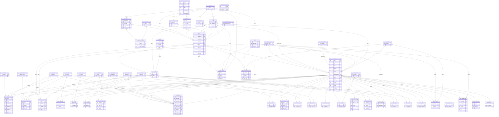

# ERD OLTP — GenBI Fútbol

```mermaid
erDiagram
    BODY_PART {
        int body_part_id PK
        text body_part_name
    }
    CARD_TYPE {
        int card_type_id PK
        text card_type_name
    }
    COMPETITION {
        int competition_id PK
        text competition_name
        int country_id FK
        text competition_gender
        bool is_youth
        bool is_international
    }
    COUNTRY ||--o{ COMPETITION : "country_id"
    COMPETITION_SEASON {
        int competition_id PK
        int season_id PK
        timestamptz match_updated
        bool match_available
    }
    COMPETITION ||--o{ COMPETITION_SEASON : "competition_id"
    SEASON ||--o{ COMPETITION_SEASON : "season_id"
    COMPETITION_STAGE {
        int competition_stage_id PK
        text competition_stage_name
    }
    COUNTRY {
        int country_id PK
        text country_name
    }
    DUEL_TYPE {
        int duel_type_id PK
        text duel_type_name
    }
    EVENT {
        uuid event_id PK
        int match_id FK
        int index
        int period
        timestamptz timestamp
        int minute
        num second
        int type_id FK
        int possession
        int possession_team_id FK
        int play_pattern_id FK
        int team_id FK
        int player_id FK
        int position_id FK
        num location_x
        num location_y
        num duration
        bool under_pressure
        bool off_camera
        bool out
    }
    MATCH ||--o{ EVENT : "match_id"
    EVENT_TYPE ||--o{ EVENT : "type_id"
    TEAM ||--o{ EVENT : "possession_team_id"
    PLAY_PATTERN ||--o{ EVENT : "play_pattern_id"
    TEAM ||--o{ EVENT : "team_id"
    PLAYER ||--o{ EVENT : "player_id"
    POSITION ||--o{ EVENT : "position_id"
    EVENT_50_50 {
        uuid event_id PK
        int outcome_id FK
    }
    EVENT ||--o{ EVENT_50_50 : "event_id"
    OUTCOME ||--o{ EVENT_50_50 : "outcome_id"
    EVENT_BAD_BEHAVIOUR {
        uuid event_id PK
        int card_type_id FK
    }
    EVENT ||--o{ EVENT_BAD_BEHAVIOUR : "event_id"
    CARD_TYPE ||--o{ EVENT_BAD_BEHAVIOUR : "card_type_id"
    EVENT_BALL_RECEIPT {
        uuid event_id PK
        int outcome_id FK
    }
    EVENT ||--o{ EVENT_BALL_RECEIPT : "event_id"
    OUTCOME ||--o{ EVENT_BALL_RECEIPT : "outcome_id"
    EVENT_BLOCK {
        uuid event_id PK
        int body_part_id FK
        bool deflection
        bool offensive
        bool saved_shot
    }
    EVENT ||--o{ EVENT_BLOCK : "event_id"
    BODY_PART ||--o{ EVENT_BLOCK : "body_part_id"
    EVENT_CARRY {
        uuid event_id PK
        num end_location_x
        num end_location_y
    }
    EVENT ||--o{ EVENT_CARRY : "event_id"
    EVENT_CLEARANCE {
        uuid event_id PK
        int body_part_id FK
        int outcome_id FK
        bool under_pressure
    }
    EVENT ||--o{ EVENT_CLEARANCE : "event_id"
    BODY_PART ||--o{ EVENT_CLEARANCE : "body_part_id"
    OUTCOME ||--o{ EVENT_CLEARANCE : "outcome_id"
    EVENT_DRIBBLE {
        uuid event_id PK
        int outcome_id FK
        bool overrun
        bool nutmeg
        bool no_touch
    }
    EVENT ||--o{ EVENT_DRIBBLE : "event_id"
    OUTCOME ||--o{ EVENT_DRIBBLE : "outcome_id"
    EVENT_DUEL {
        uuid event_id PK
        int duel_type_id FK
        int outcome_id FK
    }
    EVENT ||--o{ EVENT_DUEL : "event_id"
    DUEL_TYPE ||--o{ EVENT_DUEL : "duel_type_id"
    OUTCOME ||--o{ EVENT_DUEL : "outcome_id"
    EVENT_FOUL_COMMITTED {
        uuid event_id PK
        int card_type_id FK
        text foul_type
        bool advantage
        bool penalty
    }
    EVENT ||--o{ EVENT_FOUL_COMMITTED : "event_id"
    CARD_TYPE ||--o{ EVENT_FOUL_COMMITTED : "card_type_id"
    EVENT_FOUL_WON {
        uuid event_id PK
        bool defensive
        bool advantage
        bool penalty
    }
    EVENT ||--o{ EVENT_FOUL_WON : "event_id"
    EVENT_GOALKEEPER {
        uuid event_id PK
        int goalkeeper_type_id FK
        int outcome_id FK
        int technique_id FK
        int body_part_id FK
    }
    EVENT ||--o{ EVENT_GOALKEEPER : "event_id"
    GOALKEEPER_TYPE ||--o{ EVENT_GOALKEEPER : "goalkeeper_type_id"
    OUTCOME ||--o{ EVENT_GOALKEEPER : "outcome_id"
    TECHNIQUE ||--o{ EVENT_GOALKEEPER : "technique_id"
    BODY_PART ||--o{ EVENT_GOALKEEPER : "body_part_id"
    EVENT_HALF_START {
        uuid event_id PK
        bool late_video_start
    }
    EVENT ||--o{ EVENT_HALF_START : "event_id"
    EVENT_INTERCEPTION {
        uuid event_id PK
        int outcome_id FK
    }
    EVENT ||--o{ EVENT_INTERCEPTION : "event_id"
    OUTCOME ||--o{ EVENT_INTERCEPTION : "outcome_id"
    EVENT_MISCONTROL {
        uuid event_id PK
        int outcome_id FK
    }
    EVENT ||--o{ EVENT_MISCONTROL : "event_id"
    OUTCOME ||--o{ EVENT_MISCONTROL : "outcome_id"
    EVENT_PASS {
        uuid event_id PK
        num pass_length
        num pass_angle
        int pass_height_id FK
        int pass_type_id FK
        int technique_id FK
        int body_part_id FK
        int outcome_id FK
        int recipient_id FK
        bool is_assist
        bool is_shot_assist
        bool is_goal_assist
    }
    EVENT ||--o{ EVENT_PASS : "event_id"
    PASS_HEIGHT ||--o{ EVENT_PASS : "pass_height_id"
    PASS_TYPE ||--o{ EVENT_PASS : "pass_type_id"
    TECHNIQUE ||--o{ EVENT_PASS : "technique_id"
    BODY_PART ||--o{ EVENT_PASS : "body_part_id"
    OUTCOME ||--o{ EVENT_PASS : "outcome_id"
    PLAYER ||--o{ EVENT_PASS : "recipient_id"
    EVENT_PLAYER_OFF {
        uuid event_id PK
        bool permanent
        int outcome_id FK
    }
    EVENT ||--o{ EVENT_PLAYER_OFF : "event_id"
    OUTCOME ||--o{ EVENT_PLAYER_OFF : "outcome_id"
    EVENT_RELATION {
        uuid event_id PK
        uuid related_event_id PK
    }
    EVENT ||--o{ EVENT_RELATION : "event_id"
    EVENT ||--o{ EVENT_RELATION : "related_event_id"
    EVENT_SHOT {
        uuid event_id PK
        num xg
        bool is_goal
        int shot_type_id FK
        int body_part_id FK
        int technique_id FK
        int outcome_id FK
        bool first_time
        bool open_goal
        bool deflected
    }
    EVENT ||--o{ EVENT_SHOT : "event_id"
    SHOT_TYPE ||--o{ EVENT_SHOT : "shot_type_id"
    BODY_PART ||--o{ EVENT_SHOT : "body_part_id"
    TECHNIQUE ||--o{ EVENT_SHOT : "technique_id"
    OUTCOME ||--o{ EVENT_SHOT : "outcome_id"
    EVENT_SUBSTITUTION {
        uuid event_id PK
        int replacement_id FK
        int outcome_id FK
    }
    EVENT ||--o{ EVENT_SUBSTITUTION : "event_id"
    PLAYER ||--o{ EVENT_SUBSTITUTION : "replacement_id"
    OUTCOME ||--o{ EVENT_SUBSTITUTION : "outcome_id"
    EVENT_TYPE {
        int event_type_id PK
        text event_type_name
    }
    FORMATION {
        int formation_id PK
        text formation_name
    }
    GOALKEEPER_TYPE {
        int goalkeeper_type_id PK
        text goalkeeper_type_name
    }
    INGESTION_FILE {
        uuid run_id FK
        text source_path
        text file_sha256
        text entity
        int rows
        text status
    }
    INGESTION_RUN ||--o{ INGESTION_FILE : "run_id"
    INGESTION_RUN {
        uuid run_id PK
        timestamptz started_at
        timestamptz finished_at
        text status
        text scope
        int files_processed
        int rows_written
        text error_summary
    }
    MANAGER {
        int manager_id PK
        text name
        text nickname
        date date_of_birth
        int country_id FK
    }
    COUNTRY ||--o{ MANAGER : "country_id"
    MATCH {
        int match_id PK
        int competition_id FK
        int season_id FK
        int home_team_id FK
        int away_team_id FK
        int stadium_id FK
        int referee_id FK
        int competition_stage_id FK
        date match_date
        timestamptz kick_off
        int home_score
        int away_score
        int match_week
    }
    COMPETITION ||--o{ MATCH : "competition_id"
    SEASON ||--o{ MATCH : "season_id"
    TEAM ||--o{ MATCH : "home_team_id"
    TEAM ||--o{ MATCH : "away_team_id"
    STADIUM ||--o{ MATCH : "stadium_id"
    REFEREE ||--o{ MATCH : "referee_id"
    COMPETITION_STAGE ||--o{ MATCH : "competition_stage_id"
    MATCH_MANAGER {
        int match_id PK
        int team_id PK
        int manager_id PK
    }
    MATCH ||--o{ MATCH_MANAGER : "match_id"
    TEAM ||--o{ MATCH_MANAGER : "team_id"
    MANAGER ||--o{ MATCH_MANAGER : "manager_id"
    MATCH_PLAYER {
        int match_id PK
        int player_id PK
        int team_id FK
        int jersey_number
        int country_id FK
    }
    MATCH ||--o{ MATCH_PLAYER : "match_id"
    PLAYER ||--o{ MATCH_PLAYER : "player_id"
    TEAM ||--o{ MATCH_PLAYER : "team_id"
    COUNTRY ||--o{ MATCH_PLAYER : "country_id"
    MATCH_PLAYER_CARD {
        int match_id PK
        int player_id PK
        int card_seq PK
        int card_type_id FK
        int minute
        text reason
    }
    MATCH ||--o{ MATCH_PLAYER_CARD : "match_id"
    PLAYER ||--o{ MATCH_PLAYER_CARD : "player_id"
    CARD_TYPE ||--o{ MATCH_PLAYER_CARD : "card_type_id"
    MATCH_PLAYER_POSITION {
        int match_id PK
        int player_id PK
        int position_id PK
        int from_period PK
        num from_time PK
    }
    MATCH ||--o{ MATCH_PLAYER_POSITION : "match_id"
    PLAYER ||--o{ MATCH_PLAYER_POSITION : "player_id"
    POSITION ||--o{ MATCH_PLAYER_POSITION : "position_id"
    OUTCOME {
        int outcome_id PK
        text outcome_name
    }
    PASS_HEIGHT {
        int pass_height_id PK
        text pass_height_name
    }
    PASS_TYPE {
        int pass_type_id PK
        text pass_type_name
    }
    PLAY_PATTERN {
        int play_pattern_id PK
        text play_pattern_name
    }
    PLAYER {
        int player_id PK
        text player_name
        text player_nickname
        int country_id FK
    }
    COUNTRY ||--o{ PLAYER : "country_id"
    POSITION {
        int position_id PK
        text position_name
    }
    REFEREE {
        int referee_id PK
        text referee_name
        int country_id FK
    }
    COUNTRY ||--o{ REFEREE : "country_id"
    SEASON {
        int season_id PK
        text season_name
    }
    SEMANTIC_EMBEDDING {
        text entity_ref
        text kind
        USER-DEFINED embedding
    }
    SHOT_FREEZE_FRAME {
        uuid event_id PK
        int frame_idx PK
        int player_id FK
        bool is_teammate
        bool is_actor
        bool is_keeper
        num x
        num y
    }
    EVENT ||--o{ SHOT_FREEZE_FRAME : "event_id"
    PLAYER ||--o{ SHOT_FREEZE_FRAME : "player_id"
    SHOT_TYPE {
        int shot_type_id PK
        text shot_type_name
    }
    STADIUM {
        int stadium_id PK
        text stadium_name
        int country_id FK
    }
    COUNTRY ||--o{ STADIUM : "country_id"
    TACTICS_LINEUP {
        uuid event_id PK
        int formation_id FK
    }
    EVENT ||--o{ TACTICS_LINEUP : "event_id"
    FORMATION ||--o{ TACTICS_LINEUP : "formation_id"
    TACTICS_PLAYER {
        uuid event_id PK
        int player_id PK
        int position_id FK
        int jersey_number
    }
    EVENT ||--o{ TACTICS_PLAYER : "event_id"
    PLAYER ||--o{ TACTICS_PLAYER : "player_id"
    POSITION ||--o{ TACTICS_PLAYER : "position_id"
    TEAM {
        int team_id PK
        text team_name
        text team_gender
        int country_id FK
    }
    COUNTRY ||--o{ TEAM : "country_id"
    TECHNIQUE {
        int technique_id PK
        text technique_name
    }
    THREE_SIXTY_ACTOR {
        uuid event_id PK
        int actor_idx PK
        bool is_teammate
        bool is_actor
        bool is_keeper
        num x
        num y
    }
    EVENT ||--o{ THREE_SIXTY_ACTOR : "event_id"
    THREE_SIXTY_FRAME {
        uuid event_id PK
        jsonb visible_area
    }
    EVENT ||--o{ THREE_SIXTY_FRAME : "event_id"
```

**56 tablas** en esquema `oltp` · generado por `scripts/gen_erd.py` desde el esquema real.
